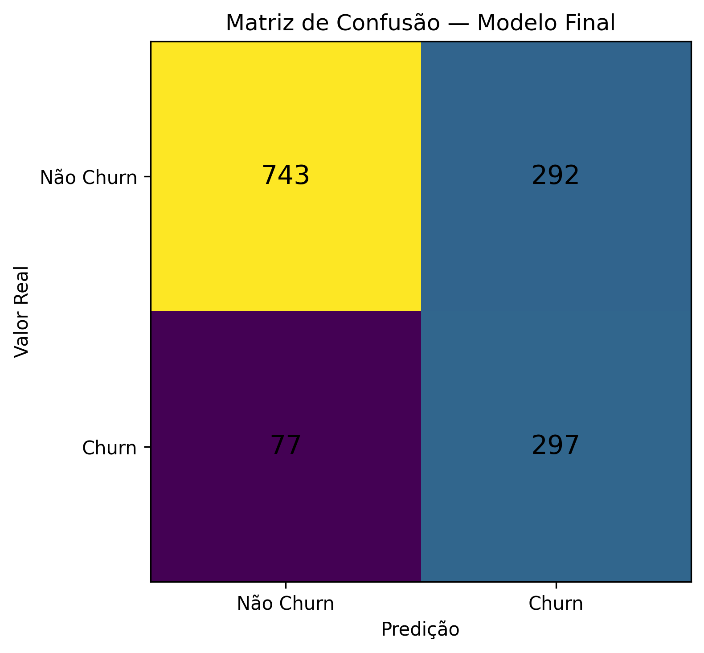
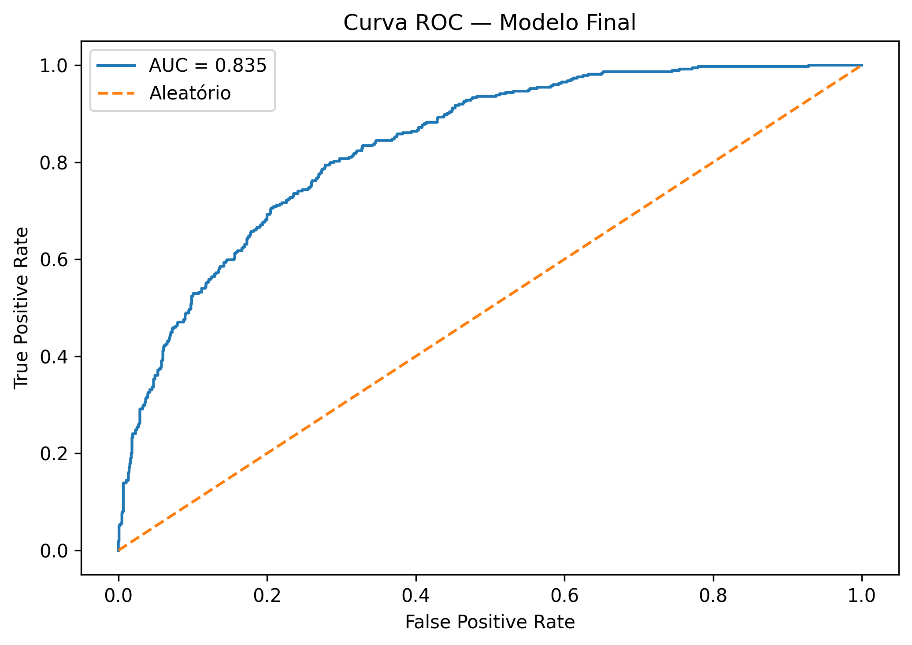

# 📡 Telecom X BR II — Predição de Churn com Machine Learning


## 🎯 Visão Geral

O **Telecom X BR II** é um projeto de Machine Learning aplicado à **predição de churn de clientes**, desenvolvido como evolução da análise exploratória realizada no Telecom X BR I. 

O objetivo é transformar dados históricos de clientes em um modelo capaz de identificar perfis com maior risco de cancelamento e apoiar estratégias de **retenção, CRM e tomada de decisão orientada por dados**.

Mais do que maximizar a acurácia, o projeto prioriza a capacidade de identificar clientes que efetivamente apresentam churn, utilizando **Recall** como uma das principais métricas de avaliação.

---

## 💼 Problema de Negócio

A perda de clientes impacta diretamente receita, custo de aquisição e crescimento sustentável de empresas de serviços.

Em um cenário tradicional, ações de retenção costumam acontecer depois que sinais de insatisfação já se tornaram evidentes.

A proposta deste projeto é utilizar Machine Learning para responder à pergunta:

> **Quais clientes apresentam maior probabilidade de churn e poderiam ser priorizados em ações preventivas de retenção?**

Um modelo preditivo pode funcionar como uma camada adicional de inteligência para áreas de **CRM, Customer Success, Marketing e Gestão Comercial**, permitindo priorizar esforços antes do cancelamento.

---

## 🧠 Abordagem

O projeto foi reconstruído com um pipeline enxuto e reproduzível, dividido em sete blocos:

1. **Carga e diagnóstico inicial dos dados**
2. **Definição da variável-alvo e prevenção de target leakage**
3. **Divisão treino/teste e pré-processamento**
4. **Treinamento e comparação de modelos baseline**
5. **Otimização do modelo selecionado**
6. **Avaliação final**
7. **Interpretação dos resultados e recomendações de negócio**

A variável-alvo foi definida explicitamente como:

```text
0 = Não Churn
1 = Churn
```

Registros sem informação válida de churn foram excluídos da modelagem supervisionada.

O conjunto de teste permaneceu separado do processo de treinamento e otimização.

---

## 📊 Dataset

Após a validação da variável-alvo:

- **7.267 registros** no dataset original
- **224 registros** sem target válido
- **7.043 registros** utilizados na modelagem
- aproximadamente **26,5% de churn**
- aproximadamente **73,5% de não churn**

A divisão entre treino e teste foi realizada de forma **estratificada**, preservando a distribuição da variável-alvo.

---

## ⚙️ Pré-processamento

O pipeline de preparação dos dados inclui:

- tratamento de valores ausentes;
- padronização de variáveis numéricas;
- codificação de variáveis categóricas;
- separação estratificada entre treino e teste;
- remoção das variáveis diretamente relacionadas ao target;
- prevenção de **target leakage**;
- aplicação do pré-processamento aprendido exclusivamente no conjunto de treino.

Essa abordagem evita que informações do conjunto de teste sejam utilizadas durante o treinamento do modelo.

---

## 🤖 Modelos Avaliados

Foram comparados três algoritmos de classificação:

- **Logistic Regression**
- **Random Forest**
- **Gradient Boosting**

Os modelos foram avaliados considerando:

- Accuracy
- Precision
- Recall
- F1-score
- ROC-AUC

Para o contexto de churn, foi dada atenção especial ao **Recall da classe positiva**, pois falsos negativos representam clientes que efetivamente apresentam churn, mas não são identificados pelo modelo.

A otimização foi realizada exclusivamente sobre os dados de treinamento, utilizando validação cruzada.

---

## 🏆 Resultado do Modelo Final

O modelo final apresentou os seguintes resultados no conjunto de teste:

| Métrica | Resultado |
|---|---:|
| **Accuracy** | **73,81%** |
| **Precision** | **50,42%** |
| **Recall** | **79,41%** |
| **F1-score** | **61,68%** |
| **ROC-AUC** | **0,8352** |

### 🔎 Como interpretar esses resultados?

O **Recall de 79,41%** indica que o modelo conseguiu identificar aproximadamente **8 em cada 10 casos reais de churn** presentes no conjunto de teste.

A **Precision de 50,42%** evidencia um trade-off relevante: ao priorizar maior cobertura dos clientes que podem cancelar, o modelo também produz falsos positivos.

Em uma aplicação real, esse equilíbrio deve ser analisado em conjunto com o custo das ações de retenção e o valor econômico da perda de clientes.

O **ROC-AUC de 0,8352** indica boa capacidade do modelo de discriminar entre clientes com e sem churn ao longo de diferentes thresholds de classificação.

---

## 🔎 Matriz de Confusão



A matriz de confusão permite avaliar quatro situações:

- **True Positive (TP):** churn corretamente identificado;
- **True Negative (TN):** não churn corretamente identificado;
- **False Positive (FP):** cliente sinalizado como risco, mas que não apresentou churn;
- **False Negative (FN):** churn que o modelo não conseguiu identificar.

Para uma estratégia de retenção, os **False Negatives** merecem atenção especial, pois representam clientes em risco que poderiam não receber uma intervenção preventiva.

---

## 📈 Curva ROC



A curva ROC mostra a relação entre a taxa de verdadeiros positivos e falsos positivos em diferentes thresholds.

O modelo alcançou:

> **ROC-AUC = 0,8352**

Esse resultado demonstra capacidade discriminativa relevante e reforça que o threshold padrão de `0.50` não precisa necessariamente ser o ponto operacional ideal.

Em um cenário real, o threshold poderia ser ajustado de acordo com:

- custo de retenção;
- valor do cliente;
- capacidade operacional da equipe;
- custo de falsos positivos;
- custo de falsos negativos.

---

## 💡 Aplicação de Negócio

O modelo pode ser utilizado como base para uma estratégia de segmentação de risco:

### 🔴 Alto risco

Clientes com maior score de churn.

Possíveis ações:

- contato proativo;
- ofertas personalizadas;
- análise individual do relacionamento;
- campanhas específicas de retenção.

### 🟡 Médio risco

Clientes que apresentam sinais intermediários.

Possíveis ações:

- campanhas segmentadas;
- benefícios;
- acompanhamento de engajamento;
- comunicação preventiva.

### 🟢 Baixo risco

Clientes com menor probabilidade estimada de churn.

Possíveis ações:

- relacionamento regular;
- programas de fidelização;
- monitoramento preventivo.

---

## 🔄 Possível Integração com CRM

Em uma aplicação corporativa, o modelo poderia alimentar um CRM ou dashboard com um **score de risco de churn por cliente**.

Um fluxo possível seria:

```text
Dados de clientes
       ↓
Pré-processamento
       ↓
Modelo de Machine Learning
       ↓
Probabilidade de Churn
       ↓
Segmentação de Risco
       ↓
CRM / Customer Success / Marketing
       ↓
Ação de Retenção
       ↓
Mensuração de Resultado
```

Essa arquitetura transforma o modelo em uma ferramenta de apoio à decisão, e não apenas em um exercício de classificação.

---

## ⚠️ Limitações

Os resultados devem ser interpretados dentro do contexto do dataset utilizado.

Antes de uma aplicação em produção, seriam necessárias etapas adicionais, como:

- validação com dados mais recentes;
- análise temporal do churn;
- monitoramento de **data drift** e **concept drift**;
- calibração do threshold com base no custo de negócio;
- avaliação financeira das ações de retenção;
- testes controlados das intervenções;
- monitoramento e retreinamento periódico do modelo.

Além disso, associações encontradas nos dados não devem ser automaticamente interpretadas como relações causais.

---

## 🛠️ Tecnologias

- **Python**
- **Pandas**
- **NumPy**
- **Scikit-learn**
- **Matplotlib**
- **Google Colab**
- **Git / GitHub**

Principais técnicas utilizadas:

- classificação supervisionada;
- train/test split estratificado;
- pipelines de pré-processamento;
- StandardScaler;
- One-Hot Encoding;
- Logistic Regression;
- Random Forest;
- Gradient Boosting;
- validação cruzada;
- otimização de hiperparâmetros;
- matriz de confusão;
- curva ROC;
- ROC-AUC.

---

## 📁 Estrutura do Repositório

```text
Telecom-X-BR-II/
│
├── Telecom_X_BR_II.ipynb
├── README.md
│
└── images/
    ├── confusion_matrix.png
    └── roc_curve.png
```

O notebook contém o pipeline completo e reproduzível da modelagem.

---

## ▶️ Como Executar

1. Clone este repositório:

```bash
git clone https://github.com/MCLG1661/Telecom-X-BR-II.git
```

2. Abra o arquivo:

```text
Telecom_X_BR_II.ipynb
```

3. Execute as células sequencialmente em ambiente compatível com Jupyter Notebook ou Google Colab.

O notebook foi estruturado para permitir a execução sequencial do pipeline completo.

---

## 🔗 Continuidade do Projeto

Este projeto é uma evolução do **Telecom X BR I**, etapa dedicada à exploração, tratamento e compreensão dos dados.

O Telecom X BR II avança para a construção de modelos preditivos e aplicação de Machine Learning ao problema de churn.

**Telecom X BR I → Análise Exploratória e compreensão do problema**

**Telecom X BR II → Modelagem Preditiva e apoio à decisão**

---

## 🏁 Conclusão

O projeto demonstra como técnicas de Machine Learning podem ser aplicadas a um problema empresarial relevante, conectando **dados, modelagem preditiva e tomada de decisão**.

O modelo final apresentou **Recall de 79,41%** e **ROC-AUC de 0,8352**, demonstrando capacidade relevante para identificar clientes pertencentes à classe de churn.

Mais importante do que produzir uma previsão isolada, a aplicação proposta permite transformar probabilidades em **priorização, segmentação e ações de retenção mensuráveis**.

Esse é o objetivo central do projeto:

> **Transformar dados de clientes em inteligência capaz de apoiar decisões de negócio.**

---

## 👤 Autor

**Marcus Guedes**

Marketing • Gestão • Projetos • Data Analytics • Inteligência Artificial aplicada a Negócios

[LinkedIn](https://www.linkedin.com/in/marcus-guedes/) • [GitHub](https://github.com/MCLG1661)

---

⭐ Se este projeto foi útil ou interessante, considere deixar uma estrela no repositório.
